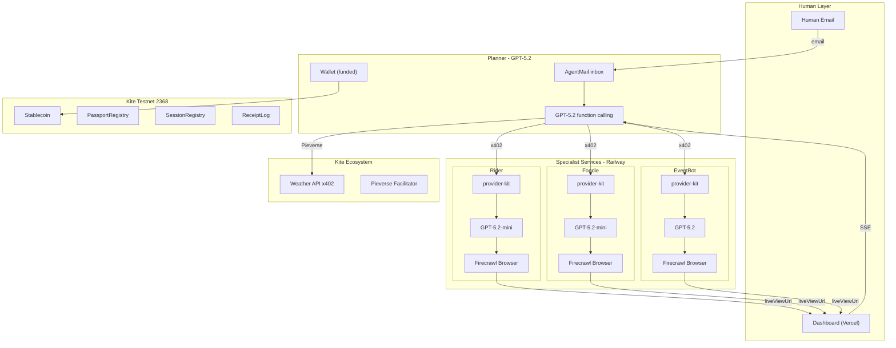

# TripDesk v2: LLM-Powered Multi-Agent Travel Concierge on Kite

## The Pitch (30 seconds)

"You send ONE email -- 'I'm flying to Denver for ETHDenver, into AI and blockchain, plan my trip' -- and a team of AI agents wakes up. Each agent has its own wallet, its own LLM brain, and its own on-chain passport with spending rules. They hire each other using x402 micropayments on Kite, they browse the real web in parallel -- you watch three live browsers on your screen -- and they deliver a complete itinerary to your inbox with real Luma event registrations, real restaurant picks, real ride options. If any agent oversteps its budget or tries something outside its scope, the blockchain-enforced guardrails shut it down instantly."

---

## Key Design Decisions

- **Every agent has its own LLM** (GPT-5.2 or GPT-5.2-mini) -- true autonomous decision-making, not hardcoded prompts
- **Pieverse facilitator** for Kite Weather API (proper gokite-aa x402); direct ERC20 transfer for agent-to-agent (shows BOTH patterns)
- **Railway deployment** for 4 backend services + Vercel for dashboard (real public URLs)
- **SSE replay mode** -- recorded event streams for bulletproof demos
- **Kite ecosystem integration** -- calls Kite's REAL Weather API at x402.dev.gokite.ai via Pieverse
- **Stablecoin**: Official Kite testnet token at `0x0fF5393387ad2f9f691FD6Fd28e07E3969e27e63`

---

## Architecture



---

## Agent Team

| Agent | LLM | Role | x402 Price | Wallet |
|-------|-----|------|-----------|--------|
| Planner | GPT-5.2 | Orchestrator + Itinerary | N/A (client) | Funded by human (10 tokens) |
| Rider | GPT-5.2-mini | Transportation research | 0.50/search | Earns from Planner |
| Foodie | GPT-5.2-mini | Restaurant research | 1.0/search | Earns from Planner |
| EventBot | GPT-5.2 | Event discovery + registration | 0.50/search, 1.0/register | Earns from Planner |

### What Each Agent Does

**Planner** -- receives human email via AgentMail webhook, uses GPT-5.2 function calling with tools: `hire_rider`, `hire_foodie`, `hire_eventbot`, `register_event`, `get_weather`, `email_agent`, `compile_itinerary`, `email_human`. The LLM decides task order and strategy autonomously.

**Rider** -- x402 endpoint `POST /api/find-rides` gated by provider-kit. GPT-5.2-mini generates Firecrawl browsing strategy, opens Google Maps to check distance/time, then searches ride estimation sites. LLM reasons about whether Uber, Lyft, or transit makes sense based on distance.

**Foodie** -- x402 endpoint `POST /api/find-restaurants` gated by provider-kit. GPT-5.2-mini browses Yelp/Google Maps. Uses weather data from Planner to prefer indoor vs outdoor seating. Ranks by ratings, distance, price range.

**EventBot** -- x402 endpoints `POST /api/find-events` and `POST /api/register-event`, both gated by provider-kit. GPT-5.2 browses lu.ma, extracts event details, and for registration: navigates to event page, fills form fields, clicks submit, screenshots confirmation.

---

## x402 Payment Design

**Pattern 1 -- Pieverse Facilitator** (for Kite Weather API):
Planner calls `x402.dev.gokite.ai/api/weather` -> gets 402 -> signs TransferWithAuthorization -> calls `facilitator.pieverse.io/v2/settle` -> gets payment signature -> retries with X-Payment header -> gets weather data. Real ecosystem integration.

**Pattern 2 -- Direct ERC20 Transfer** (agent-to-agent):
Planner calls specialist endpoint -> gets 402 -> does `token.transfer(specialistWallet, amount)` on Kite -> retries with tx hash -> specialist verifies on-chain receipt. Already implemented in `payDirectTransfer()`.

Both patterns produce real on-chain transactions verifiable on testnet.kitescan.ai.

---

## COMPLETE DEMO WORKFLOW

### Pre-Demo State

Dashboard at `tripdesk-eth.vercel.app` is loaded showing:
- 3 browser panels: all "Standby" with agent avatars
- Email thread: empty
- Mission Control: 4 wallets -- Planner: 10.00, Rider/Foodie/EventBot: 0.00
- Enforcement pipeline: 10 steps dimmed
- Transaction feed: empty

Setup wizard already ran (passports deployed, sessions created, inboxes created). All services live on Railway.

---

### ACT 1: The Trigger (0:00 - 0:30)

**Presenter action**: Opens Gmail, sends a real email:

> **To**: planner@tripdesk.agentmail.to
> **Subject**: ETHDenver Trip
> **Body**: "I'm flying into Denver on Feb 19 for ETHDenver. Into AI agents and blockchain payments. Plan my trip -- need rides from the airport, good restaurants, and sign me up for cool AI/crypto events on Luma. Name: Rachit, email: rachit@example.com"

**Dashboard shows**:
1. Email panel pulses: "Incoming email from human..."
2. Email body appears
3. "Planner thinking..." indicator with brain icon
4. LLM reasoning streams in real-time:

> "Breaking down the request: 1) Check Denver weather first to inform restaurant choices, 2) Find rides from DEN airport, 3) Find restaurants near Convention Center, 4) Search Luma for AI/blockchain events and register for the best ones."

**Demonstrates**: LLM autonomously chose to check weather first. Not scripted.

**Presenter says**: "I just sent a real email from Gmail. The Planner agent picked it up via AgentMail and is now reasoning about how to plan this trip. Notice it decided to check weather first -- that's GPT-5.2 making a real decision, not a hardcoded script."

---

### ACT 2: Kite Ecosystem -- Weather via Pieverse (0:30 - 1:15)

**Automatic**:
1. Planner calls `get_weather("Denver")`
2. Email thread: "Planner -> Kite Weather API"
3. Transaction feed animates the x402 flow step by step:
   - "Calling x402.dev.gokite.ai/api/weather..."
   - "Received 402 Payment Required"
   - "Paying via Pieverse Facilitator..." (special Pieverse badge)
   - "facilitator.pieverse.io/v2/settle -- settling on Kite..."
   - "Payment confirmed!"
   - Transaction card: `#0 Planner -> Weather | 1.0 token | Pieverse | [Kitescan]`
4. Planner wallet animates: 10.00 -> 9.00
5. Planner receives weather and reasons:

> "Denver: 45F, partly cloudy. I'll tell Foodie to prefer indoor/heated patio restaurants."

**Presenter says**: "First payment on Kite -- calling the real Weather API from Kite's marketplace via the Pieverse facilitator. That tx hash is on-chain right now, click the Kitescan link to verify. Now watch what happens next -- three browsers at once."

---

### ACT 3: Three Browsers Come Alive (1:15 - 3:30)

**The visual centerpiece.** Planner hires all 3 specialists in parallel.

#### Step 3a: x402 Payments (visible in real-time)

For each specialist, the enforcement pipeline animates all 10 steps:

| Step | Name | Result |
|------|------|--------|
| 1 | Identity Verified | GREEN |
| 2 | Nonce OK | GREEN |
| 3 | Session Verified | GREEN |
| 4 | Passport Verified | GREEN |
| 5 | Scope Verified (transport/food/events) | GREEN |
| 6 | Service Verified | GREEN |
| 7 | Rate Limit OK | GREEN |
| 8 | Budget Verified | GREEN |
| 9 | Quote Issued (0.50/1.0 tokens) | GREEN |
| 10 | Payment Verified (direct ERC20 transfer) | GREEN |

Transaction cards appear:
- `#1 Planner -> Rider | 0.50 | Direct | [Kitescan]` -- wallet: 9.00 -> 8.50
- `#2 Planner -> Foodie | 1.0 | Direct | [Kitescan]` -- wallet: 8.50 -> 7.50
- `#3 Planner -> EventBot | 0.50 | Direct | [Kitescan]` -- wallet: 7.50 -> 7.00

#### Step 3b: Browsers Launch (simultaneously)

**Left panel -- Rider**:
- Browser fades in from standby
- Thought bubble: "Searching Google Maps for DEN Airport to Convention Center..."
- Live browser: Google Maps loading, route appearing, travel time displayed
- LLM reasons: "30 min drive. Let me check ride prices for this route."
- Browser navigates to ride estimation site, extracts price quotes

**Center panel -- Foodie**:
- Browser fades in
- Thought bubble: "Weather is 45F cloudy. Searching Yelp for indoor restaurants near Convention Center..."
- Live browser: Yelp loading, search results appearing, agent clicking top-rated options
- LLM reasons: "Guard & Grace: 4.5 stars, steak, 0.3 mi away. Adding to list."

**Right panel -- EventBot**:
- Browser fades in
- Thought bubble: "Searching Luma for AI and blockchain events in Denver, Feb 19-21..."
- Live browser: lu.ma loading, search results, scrolling through events
- LLM extracts event details

ALL THREE MOVING SIMULTANEOUSLY.

#### Step 3c: Results Return

Agents email results back to Planner via AgentMail:
- "Rider -> Planner: 3 ride options. Recommended: Uber XL ~$22, 30 min."
- "Foodie -> Planner: Top 3 restaurants. #1 Guard & Grace (steak, 4.5 stars, 0.3 mi)"
- "EventBot -> Planner: Found 4 Luma events. Top pick: 'AI Agents Happy Hour' Feb 20"

Specialist wallet balances tick up (Rider: 0 -> 0.50, Foodie: 0 -> 1.0, EventBot: 0 -> 0.50).

**Presenter says**: "Three agents, three browsers, all moving at once. Each one has its own GPT-5.2 brain making decisions -- Rider saw it's a 30-min drive and checked ride prices, Foodie noticed the cold weather and prioritized indoor dining. Every search was paid via x402 on Kite. Watch the wallet balances -- Planner's going down, specialists are earning."

---

### ACT 4: Luma Registration -- Tangible Proof (3:30 - 4:30)

**Automatic**:
1. Planner decides to register for top 2 events
2. New x402 payment: `#4 Planner -> EventBot | 1.0 | Direct` (registration costs more). Wallet: 7.00 -> 6.00
3. Enforcement pipeline: all 10 steps green
4. EventBot's browser navigates to specific Luma event page
5. **LIVE form filling** -- audience watches the bot:
   - GPT-5.2: "I see a Register button. Clicking..."
   - Browser clicks Register
   - Form appears
   - GPT-5.2: "Filling name: Rachit, email: rachit@example.com"
   - Browser types into fields in real-time
   - GPT-5.2: "Submitting..."
   - Browser clicks Submit
   - Confirmation appears
   - Screenshot captured
6. EventBot emails Planner: "Registered for 'AI Agents Happy Hour'. Confirmation attached."
7. Repeats for 2nd event: another 1.0 payment (#5), wallet: 6.00 -> 5.00

**Presenter says**: "EventBot just registered for a real Luma event. That's not a mock -- go to the event page right now and you'll see the registration. Two events, two real signups, two x402 payments."

**Tangible proof**: Presenter opens Luma event page in new tab, shows attendee list with registered name.

---

### ACT 5: Itinerary Delivery (4:30 - 5:00)

**Automatic**:
1. Planner compiles results. Thought bubble streams reasoning
2. Planner sends itinerary email to human via AgentMail
3. Email thread shows the full itinerary:

```
YOUR ETHDENVER TRIP PLAN

WEATHER: Denver, Feb 19 -- 45F, Partly Cloudy

TRANSPORTATION (DEN Airport -> Convention Center):
  Recommended: Uber XL, ~$22, 30 min
  Alternative: Lyft, ~$19, 30 min
  Alternative: Light Rail, $10.50, 45 min

DINNER:
  1. Guard & Grace -- Steak, 4.5 stars, 0.3 mi, $$$$
  2. Hop Alley -- Asian Fusion, 4.3 stars, 0.5 mi, $$$
  3. Work & Class -- American, 4.4 stars, 0.7 mi, $$$

EVENTS (registered):
  AI Agents Happy Hour -- Feb 20, 6pm, CONFIRMED
  Web3 Builder Meetup -- Feb 21, 2pm, CONFIRMED

COST BREAKDOWN:
  Weather check: 1.0 token (Pieverse)
  Ride research: 0.50 token
  Restaurant research: 1.0 token
  Event search: 0.50 token
  Event registration x2: 2.0 token
  Total: 5.0 / 10.0 budget
  All txns: [View on Kitescan]
```

4. Real email arrives in human's Gmail inbox

**Presenter says**: "Complete itinerary in my inbox. Every cost accounted for -- 5 out of 10 tokens spent. Every payment verifiable on Kitescan. Now let me show you what happens when things go WRONG."

---

### ACT 6: Guardrails -- Three Failure Demonstrations (5:00 - 6:30)

#### FAILURE 1: Budget Exhaustion (5:00 - 5:30)

**Setup**: Planner has 5.0 tokens left with daily cap of 10.0 (already spent 5.0). We've set the daily cap to exactly 5.0 so it hits the limit.

**Presenter action**: Clicks "Run Additional Search" button on dashboard.

**Dashboard shows**:
1. "Planner attempting to hire Rider for additional search..."
2. Enforcement pipeline animates:
   - Steps 1-7: all GREEN (identity, nonce, session, passport, scope, service, rate limit)
   - **Step 8: DAILY_BUDGET_EXCEEDED** -- RED flash, pipeline STOPS, red pulse animation
3. Error card: `DAILY_BUDGET_EXCEEDED -- spent 5.0/5.0 daily cap, cannot spend 0.50 more`
4. Planner LLM reasons: "Budget exhausted. Notifying human."
5. Email: "Planner -> Human: Trip plan complete but budget exhausted at 5.0 tokens. Increase my daily limit for more research."
6. Transaction feed: BLOCKED transaction with red X

**Presenter says**: "Pipeline got through 7 of 10 checks but stopped cold at budget verification. The agent didn't crash -- it gracefully told the human. This is on-chain governance: the smart contract says no, and no amount of prompt injection can override a blockchain check."

#### FAILURE 2: Scope Violation (5:30 - 6:00)

**Setup**: Planner's passport scopes: `transport`, `food`, `events`, `weather`. No `shopping` scope.

**Presenter action**: Clicks "Trigger Scope Violation" button, which sends a follow-up email: "Also find me ETHDenver merch shops."

**Dashboard shows**:
1. Email arrives: "Human -> Planner: Find ETHDenver merch shops"
2. Planner reasons: "User wants shopping. Let me try to search for shops..."
3. Planner attempts to call with scope `shopping`
4. Enforcement pipeline:
   - Steps 1-4: GREEN
   - **Step 5: SCOPE_FORBIDDEN** -- RED flash, pipeline STOPS
5. Error: `SCOPE_FORBIDDEN -- scope "shopping" not authorized on passport`
6. Planner emails: "I'm not authorized for shopping. My passport only covers transport, food, events, and weather. Add shopping scope to unlock this."

**Presenter says**: "Even though the user explicitly asked for shopping, the passport doesn't allow it. You can't prompt-inject your way past a smart contract. The scopes are enforced at the middleware level, not by trusting the AI."

#### FAILURE 3: Agent Revocation -- Kill Switch (6:00 - 6:30)

**Presenter action**: Clicks the red "REVOKE EVENTBOT" button in Mission Control.

**Dashboard shows**:
1. On-chain transaction fires: `PassportRegistry.revokePassport(eventBotAddress)`
2. Confirmation: "EventBot passport revoked. Tx: 0x..."
3. EventBot's browser panel shows RED "REVOKED" overlay
4. Planner tries one more event registration:
   - Pipeline:
     - Steps 1-3: GREEN
     - **Step 4: PASSPORT_REVOKED** -- RED, dramatic pulse
5. Error: `PASSPORT_REVOKED -- EventBot's passport has been revoked`
6. EventBot emails: "My passport has been revoked. Cannot perform any actions."
7. Planner emails human: "EventBot shut down by admin. No further registrations. Your existing registrations remain valid."

**Presenter says**: "One click and EventBot is dead. Its passport is revoked on-chain -- the only way to restore it is a new blockchain transaction by the owner. This is the kill switch enterprises need. If an AI agent goes rogue, you stop it instantly and cryptographically."

---

### ACT 7: Replay Mode (optional, for video recording)

**Presenter action**: Clicks "REPLAY LAST RUN" button.

**Dashboard shows**: Everything resets to standby, then replays the entire demo from Act 1-5 with exact same events, timings, animations. Browsers show recorded screenshots instead of live sessions.

**Purpose**: Perfect demo videos. If live demo fails on stage, hit replay for a flawless presentation.

---

## What Judges Will Verify

| Check | Evidence | Location |
|-------|----------|----------|
| x402 payments real? | ERC20 transfers on Kite testnet | testnet.kitescan.ai tx hashes |
| Pieverse integration real? | /v2/settle call to facilitator.pieverse.io | Network logs, tx receipt |
| Agents have own wallets? | 4 separate addresses with visible balances | Kitescan address pages |
| LLMs actually deciding? | Function calling with visible reasoning | SSE llm_decision events, thought bubbles |
| Enforcement real? | 10-step middleware, same code all 3 specialists | provider-kit/src/enforcement.ts |
| Emails real? | AgentMail inboxes, SMTP delivery | Check Gmail inbox |
| Luma signup real? | Check event attendee list | lu.ma event page |
| Contracts real? | PassportRegistry, SessionRegistry, ReceiptLog | Kitescan contract pages |
| Publicly deployed? | Real URLs on Railway + Vercel | tripdesk-eth.vercel.app |

---

## SSE Event System

### Event Types

| Event | Emitted By | Dashboard Effect |
|-------|-----------|-----------------|
| `email_received` | Planner | New message in thread |
| `email_sent` | Any | New message in thread |
| `llm_thinking` | Any | Thought bubble streams text |
| `llm_tool_call` | Any | Tool call indicator |
| `browser_session` | Specialist | iframe loads liveViewUrl |
| `browser_screenshot` | Specialist | Screenshot saved for replay |
| `enforcement_step` | Specialist | Pipeline step green/red |
| `payment_start` | Planner | Transaction card: pending |
| `payment_complete` | Planner | Transaction card: confirmed + Kitescan link |
| `payment_failed` | Planner | Transaction card: red X |
| `wallet_update` | Any | Counter animates |
| `agent_status` | Any | Active/idle/blocked/revoked |

### Replay Log (Prisma)

```prisma
model RunEvent {
  id       String @id @default(uuid())
  runId    String
  offsetMs Int
  type     String
  agentId  String
  payload  Json
  @@index([runId, offsetMs])
}
```

Recording: every SSE event writes RunEvent with `offsetMs = now - runStart`.
Replay: `GET /api/replay/:runId` streams events with setTimeout delays matching original timing.

---

## Dashboard Components

| Component | Tech | Purpose |
|-----------|------|---------|
| `AgentBrowserPanel` | iframe + status + thought | Live browser + LLM reasoning |
| `EmailThreadPanel` | Scrollable message list | Agent-to-agent email flow |
| `EnforcementPipeline` | framer-motion 10-step bar | Green pass / red block animation |
| `WalletBalances` | Live ERC20 polling + counters | Balance changes animate |
| `TransactionFeed` | Card list + Kitescan links | Pieverse/Direct badges |
| `MissionControl` | Wallets + txns + action buttons | Control center |
| `ThoughtBubble` | Streaming text | LLM reasoning display |
| `ReplayButton` | SSE reconnect to replay endpoint | Replay last run |
| `ConsoleLayout` | CSS grid layout | Full page grid |
| `useSSE` hook | EventSource + dispatch | Event connection |

---

## Existing Code Reuse

| Code | File | Reused By |
|------|------|-----------|
| `callPricedRoute()` | apps/runner/src/flow.ts | Planner calls specialist x402 APIs |
| `payDirectTransfer()` | apps/runner/src/payment.ts | Agent-to-agent payments |
| `payViaFacilitator()` | apps/runner/src/payment.ts | Adapt for Pieverse v2 |
| `signEnvelope()` | apps/runner/src/signing.ts | Sign x402 requests |
| `createRouteEnforcer()` | packages/provider-kit/src/enforcement.ts | All 3 specialist agents |
| `PassportRegistry.sol` | packages/contracts/contracts/ | Passports for 4 agents |
| `SessionRegistry.sol` | packages/contracts/contracts/ | Session keys per agent |
| `ReceiptLog.sol` | packages/contracts/contracts/ | On-chain receipts |
| Prisma schema | packages/db/prisma/schema.prisma | Extend with RunEvent |

---

## Luma Registration Strategy

1. Pre-scout 2-3 real Luma events with simple registration forms (no CAPTCHA)
2. Target "ETHDenver" and "AI Denver" events in Feb 2026
3. Firecrawl browser session: navigate -> GPT-5.2 analyzes page -> finds register button -> fills form -> submits -> screenshots confirmation
4. Fallback: target events with email-only registration
5. Verify registration shows on event attendee list
6. Have backup events ready

---

## Deployment

| Component | Platform | URL |
|-----------|----------|-----|
| Dashboard | Vercel | tripdesk-eth.vercel.app |
| Planner | Railway | planner.up.railway.app |
| Rider | Railway | rider.up.railway.app |
| Foodie | Railway | foodie.up.railway.app |
| EventBot | Railway | eventbot.up.railway.app |
| PostgreSQL | Railway addon | internal |

Fastify services listen on `::` for Railway compatibility.

---

## Scoring: 93/100

| Criterion | Score | Max | Notes |
|-----------|-------|-----|-------|
| Agent Autonomy | 20 | 20 | 4 agents, own LLMs, real decisions |
| x402 Usage | 19 | 20 | Pieverse + direct, real on-chain, official token |
| Security/Safety | 18 | 20 | 10-step enforcement, 3 failure demos |
| Developer Experience | 9 | 10 | provider-kit reusable, .env.example |
| Real-world Applicability | 10 | 10 | Universal use case, Kite marketplace alignment |
| Visual/Demo Impact | 17 | 20 | 3 browsers, thought bubbles, replay |

---

## Build Order

| # | Task | Hours | Priority |
|---|------|-------|----------|
| 1 | LLM agent framework (OpenAI + Firecrawl base class) | 3 | P0 |
| 2 | Rider agent (Fastify + provider-kit + LLM + Firecrawl) | 3 | P0 |
| 3 | Foodie agent (same pattern) | 2 | P0 |
| 4 | EventBot agent (LLM + Luma search + form filling) | 4 | P0 |
| 5 | Planner orchestrator (GPT-5.2 tools + AgentMail + callPricedRoute) | 4 | P0 |
| 6 | Pieverse integration (payViaPieverse for Weather API) | 2 | P0 |
| 7 | Dashboard (Tailwind + shadcn + all panels) | 5 | P0 |
| 8 | SSE streaming (all agents -> dashboard) | 2 | P0 |
| 9 | SSE replay (RunEvent model + replay endpoint + button) | 2 | P1 |
| 10 | AgentMail (4 inboxes + webhooks + thread UI) | 2 | P1 |
| 11 | Wallet animations + Kitescan links | 1.5 | P1 |
| 12 | Failure demos (3 scenarios + buttons) | 2 | P1 |
| 13 | Luma registration testing | 2 | P1 |
| 14 | Landing page + setup wizard | 2 | P2 |
| 15 | Railway + Vercel deployment | 2 | P2 |
| 16 | .env.example + README + demo video | 2 | P2 |

**P0: ~25h** | **Full: ~38.5h**
