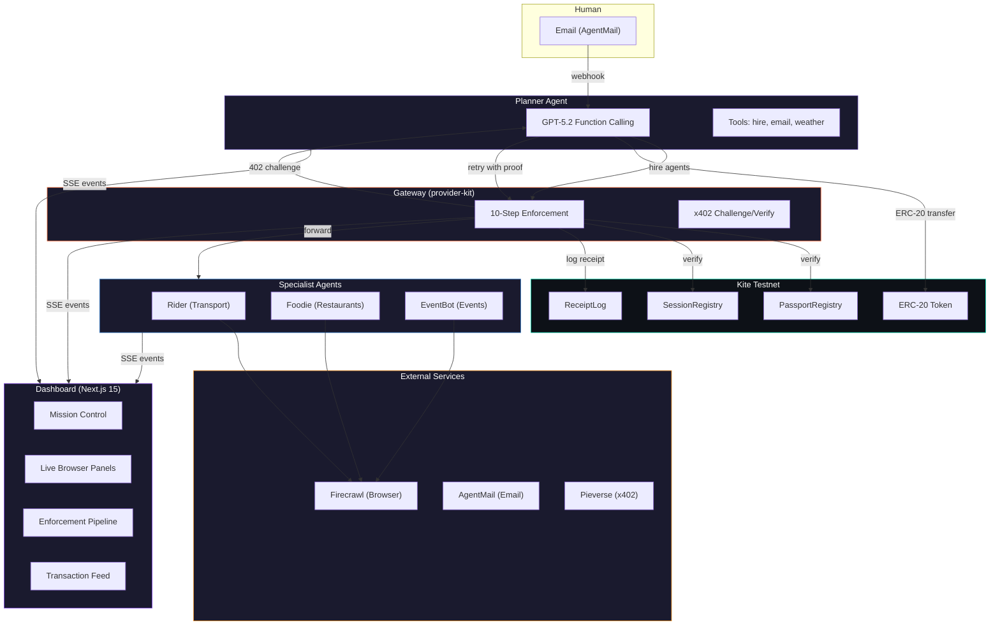

<div align="center">

#  TripDesk v2

### LLM-Powered Multi-Agent Travel Concierge on Kite

**Autonomous AI agents with on-chain passports, x402 micropayments, and real-time enforcement**

[](https://www.ethdenver.com/)
[](https://www.gokite.ai/)
[](https://www.x402.org/)

<br />

[](https://www.typescriptlang.org/)
[](https://soliditylang.org/)
[](https://nextjs.org/)
[](https://react.dev/)
[](https://fastify.dev/)
[](https://openai.com/)
[](https://www.prisma.io/)
[](https://tailwindcss.com/)
[](https://pnpm.io/)
[](LICENSE)

---

<br />

> *"What if AI agents could hire each other, pay on-chain, and every action was governed by cryptographic guardrails?"*

<br />

</div>

## The Problem

AI agents are becoming autonomous economic actors, but there's no standard way to:
- **Govern** what an agent is allowed to do
- **Pay** for services programmatically with on-chain settlement
- **Audit** every action with cryptographic proof
- **Revoke** permissions instantly when something goes wrong

## Our Solution

TripDesk is a **multi-agent travel concierge** where a team of AI agents collaboratively plan trips. Each agent has an **on-chain passport** defining its spending limits, allowed scopes, and services. Agents **hire each other** using the **x402 payment protocol** -- every transaction is settled on Kite and logged on-chain.

An owner can **revoke any agent's passport** in real-time, instantly cutting off access. A live dashboard shows every decision, payment, and enforcement step as it happens.

---

## How It Works

```
                          "Plan me a trip to Denver"
                                    |
                                    v
                        +-----------------------+
                        |   PLANNER (GPT-5.2)   |
                        |   Orchestrator Agent  |
                        +--+--------+--------+--+
                           |        |        |
                    hire   |        |        |   hire
                  (0.5 KITE)       |       (0.5 KITE)
                           |        |        |
                  +--------+  +-----+-----+  +--------+
                  |           |           |            |
                  v           v           v            v
            +---------+ +---------+ +-----------+ +---------+
            |  RIDER  | | FOODIE  | | EVENTBOT  | | WEATHER |
            | GPT-5.2 | | GPT-5.2 | |  GPT-5.2  | |  Kite   |
            |  mini   | |  mini   | |           | |  x402   |
            +----+----+ +----+----+ +-----+-----+ +---------+
                 |           |            |
                 v           v            v
            Google Maps    Yelp       lu.ma
            Ride Sites   Restaurants  Events
```

Every arrow above is an **x402 payment**. Every agent call passes through a **10-step enforcement pipeline**. Every payment is **settled on-chain**.

---

## Architecture



---

## x402 Payment Flow

Every agent-to-agent call follows the x402 protocol:

```
  Agent                      Gateway                    Blockchain
    |                           |                           |
    |   POST /api/find-rides    |                           |
    |   (signed envelope)       |                           |
    |-------------------------->|                           |
    |                           |-- verify signature        |
    |                           |-- check session           |
    |                           |-- check passport -------->|
    |                           |-- check scope             |
    |                           |-- check budget            |
    |   HTTP 402                |                           |
    |   {payTo, amount, token}  |                           |
    |<--------------------------|                           |
    |                           |                           |
    |   ERC-20 transfer         |                           |
    |-------------------------------------------------->    |
    |                           |                           |
    |   Retry + X-TX-HASH       |                           |
    |-------------------------->|                           |
    |                           |-- verify tx on-chain ---->|
    |                           |-- record receipt -------->|
    |   HTTP 200 + response     |                           |
    |<--------------------------|                           |
```

---

## 10-Step Enforcement Pipeline

Every request to a priced endpoint passes through these checks **in order**. If any step fails, the request is rejected immediately.

| Step | Check | What Happens |
|:----:|-------|-------------|
| `01` | **Identity** | Verify ECDSA signature on canonical message |
| `02` | **Nonce** | Reject replayed requests |
| `03` | **Session** | Validate session key is active and delegated |
| `04` | **Passport** | Confirm passport exists and is not revoked |
| `05` | **Scope** | Verify action is within allowed scopes |
| `06` | **Service** | Verify target service is permitted |
| `07` | **Rate Limit** | Enforce per-minute request cap |
| `08` | **Budget** | Check per-call and daily spending limits |
| `09` | **Quote** | Issue 402 challenge if unpaid |
| `10` | **Payment** | Verify on-chain settlement |

The dashboard visualizes this pipeline in real-time with animated step-by-step progression.

---

## Agent Team

| Agent | Role | LLM | Price | Capabilities |
|-------|------|-----|-------|-------------|
| **Planner** | Orchestrator | GPT-5.2 | -- | Hires specialists, manages budget, compiles itinerary |
| **Rider** | Transport | GPT-5.2-mini | 0.5 KITE/call | Google Maps, ride-hailing research via Firecrawl |
| **Foodie** | Restaurants | GPT-5.2-mini | 1.0 KITE/call | Yelp, Google Maps restaurant discovery |
| **EventBot** | Events | GPT-5.2 | 0.5-1.0 KITE | lu.ma event search + real form-filling registration |
| **Weather** | Climate | Kite API | x402 | Real Kite Weather API via Pieverse facilitator |

Each agent has its own wallet, LLM brain, and Firecrawl browser session. The Planner starts with **10 KITE tokens** and distributes them to specialists as payment for work.

---

## Smart Contracts

Three Solidity contracts on Kite testnet govern the entire system:

<details>
<summary><b>PassportRegistry.sol</b> -- Agent policy + revocation</summary>

```
upsertPassport(agent, expiresAt, perCallCap, dailyCap, rateLimitPerMin, scopes[], services[])
revokePassport(agent)          // Instant kill switch
getPassport(agent)             // Read full policy
isScopeAllowed(agent, scope)   // Fails if revoked/expired
isServiceAllowed(agent, service)
```

Defines **what** an agent can do, **how much** it can spend, and **when** its access expires.
</details>

<details>
<summary><b>SessionRegistry.sol</b> -- Short-lived delegation keys</summary>

```
grantSession(agent, sessionKey, expiresAt, scopeSubset[])
revokeSession(sessionKey)
isSessionActive(sessionKey)
hasScope(sessionKey, scope)
```

Owner grants time-limited session keys. Empty scope list = full access. References PassportRegistry for ownership verification.
</details>

<details>
<summary><b>ReceiptLog.sol</b> -- On-chain audit trail</summary>

```
recordReceipt(actionId, agent, payer, asset, amount, routeId, paymentRef, metadataHash)
getReceipt(actionId)           // Idempotent on actionId
```

Gateway writes receipt after payment verification. Only `GATEWAY_ROLE` can write. Replay-protected via unique `actionId`.
</details>

---

## Monorepo Structure

```
ETHDenver26/
|
+-- apps/
|   +-- web/              Next.js 15 dashboard (React 19, Tailwind 4, Framer Motion)
|   +-- gateway/           Fastify enforcement API + x402 middleware
|   +-- planner/           Orchestrator agent (GPT-5.2, function calling)
|   +-- rider/             Transport specialist (GPT-5.2-mini, Firecrawl)
|   +-- foodie/            Restaurant specialist (GPT-5.2-mini, Firecrawl)
|   +-- eventbot/          Event specialist (GPT-5.2, lu.ma registration)
|   +-- runner/            Autonomous test loop CLI
|
+-- packages/
|   +-- contracts/         Solidity (PassportRegistry, SessionRegistry, ReceiptLog)
|   +-- provider-kit/      Reusable x402 enforcement middleware
|   +-- agent-core/        Shared agent utilities (LLM, browser, email, SSE)
|   +-- shared-types/      TypeScript interfaces and constants
|   +-- db/                Prisma schema + PostgreSQL client (11 models)
|
+-- docs/                  Architecture, runbook, demo script
+-- render.yaml            Render deployment blueprint
```

---

## Tech Stack

<table>
<tr>
<td valign="top" width="33%">

### Frontend
<div align="center">


</div>

- SSE real-time streaming
- 3-panel browser view
- Animated enforcement pipeline
- Wallet-signed transactions

</td>
<td valign="top" width="33%">

### Backend
<div align="center">


</div>

- x402 enforcement middleware
- LLM function-calling loops
- AgentMail webhooks
- Firecrawl browser automation

</td>
<td valign="top" width="33%">

### Blockchain
<div align="center">


</div>

- 3 custom contracts
- Kite testnet (chain 2368)
- ERC-20 micropayments
- On-chain receipts & audit

</td>
</tr>
</table>

---

## Key Features

<table>
<tr>
<td width="50%">

### On-Chain Governance
- Passport policies with spending caps
- Scope and service whitelisting
- Session key delegation with expiry
- Instant revocation (one tx, all access gone)

### x402 Payments
- HTTP 402 challenge/proof/retry flow
- Pieverse facilitator integration
- Direct ERC-20 fallback
- Dual header protocol support

### Multi-Agent Orchestration
- GPT-5.2 function-calling decision loops
- Agents autonomously choose tools
- Inter-agent email via AgentMail
- Budget distribution and tracking

</td>
<td width="50%">

### Real-Time Dashboard
- Live Firecrawl browser panels
- 10-step enforcement animation
- Transaction feed with Kitescan links
- Email thread visualization
- Wallet balance polling

### Live Failure Demos
- Budget exhaustion (step 8 blocks)
- Scope violation (step 5 rejects)
- Passport revocation (step 4 kills)
- Full enforcement trace on every failure

### SSE Replay System
- Record complete agent runs
- Replay with exact original timing
- Bulletproof demo mode
- Event types: `llm_thinking`, `payment_*`, `browser_session`

</td>
</tr>
</table>

---

## Quick Start
See:
- `docs/setup-and-runbook.md`
- `docs/architecture.md`
- `docs/demo-script.md`
- `docs/real-customer-e2e.md`
- `docs/productization-roadmap.md`
- `docs/frontend-prd.md`
- `docs/realistic-agent-mission-runbook.md`

### Prerequisites

- Node.js 20+
- pnpm 9+
- PostgreSQL 14+
- Kite testnet RPC access

### Installation

```bash
# Clone the repository
git clone https://github.com/anishnarang9/ETHDenver26.git
cd ETHDenver26

# Install dependencies
pnpm install

# Set up environment variables
cp .env.example .env
# Edit .env with your API keys and contract addresses

# Set up the database
pnpm --filter @kite/db db:push

# Deploy contracts (requires Kite testnet funds)
pnpm --filter @kite/contracts deploy:testnet

# Start all services
pnpm dev
```

### Environment Variables

```env
# AI & Services
OPENAI_API_KEY=sk-...
FIRECRAWL_API_KEY=fc-...
AGENTMAIL_API_KEY=am-...

# Blockchain
KITE_RPC_URL=https://rpc-testnet.gokite.ai/
PASSPORT_REGISTRY_ADDRESS=0x...
SESSION_REGISTRY_ADDRESS=0x...
RECEIPT_LOG_ADDRESS=0x...
PAYMENT_ASSET=0x0fF5393387ad2f9f691FD6Fd28e07E3969e27e63

# Agent Keys
PLANNER_PRIVATE_KEY=0x...
GATEWAY_SIGNER_KEY=0x...

# x402
FACILITATOR_URL=https://facilitator.pieverse.io
```

---

## Documentation

| Document | Description |
|----------|-------------|
| [`docs/architecture.md`](docs/architecture.md) | System architecture and data flow |
| [`docs/setup-and-runbook.md`](docs/setup-and-runbook.md) | Deployment guide and operations |
| [`docs/demo-script.md`](docs/demo-script.md) | Step-by-step demo walkthrough |
| [`docs/frontend-prd.md`](docs/frontend-prd.md) | Dashboard product requirements |
| [`docs/productization-roadmap.md`](docs/productization-roadmap.md) | Future roadmap and milestones |

---

## Deployment

### Render (Backend)

All microservices deploy via the included `render.yaml` blueprint:

| Service | Type | Description |
|---------|------|-------------|
| `kite-gateway` | Web Service | Enforcement API + x402 middleware |
| `kite-planner` | Web Service | Orchestrator agent |
| `kite-rider` | Web Service | Transport specialist |
| `kite-foodie` | Web Service | Restaurant specialist |
| `kite-eventbot` | Web Service | Event specialist |
| `kite-db` | PostgreSQL | Shared database |

### Vercel (Frontend)

The Next.js dashboard deploys to Vercel with zero config.

---

## Demo Scenarios

### Happy Path
> Human emails: *"Plan a trip to Denver this weekend"*
>
> Planner checks weather (x402) -> hires Rider (x402) -> hires Foodie (x402) -> hires EventBot (x402) -> compiles itinerary -> emails human back

### Budget Exhaustion
> After several hires, Planner's daily budget runs out -> enforcement pipeline blocks at **Step 8** -> dashboard shows red `DAILY_BUDGET_EXCEEDED`

### Scope Violation
> Agent tries to access `shopping` scope (not in passport) -> enforcement blocks at **Step 5** -> `SCOPE_FORBIDDEN`

### Instant Revocation
> Owner clicks "REVOKE" on dashboard -> on-chain passport update -> next agent call fails at **Step 4** -> `PASSPORT_REVOKED`

---

## External Integrations

| Service | Purpose | Protocol |
|---------|---------|----------|
| [Kite Testnet](https://www.gokite.ai/) | Blockchain (chain 2368) | ERC-20, Smart Contracts |
| [Pieverse](https://facilitator.pieverse.io) | x402 facilitator | x402 settlement |
| [AgentMail](https://agentmail.to) | Agent email inboxes | REST API + Webhooks |
| [Firecrawl](https://firecrawl.dev) | Browser automation | REST API |
| [OpenAI](https://openai.com) | LLM reasoning | Function calling |
| [Kite Weather](https://x402.dev.gokite.ai) | Weather data | x402 native |

---

## Contributing

We welcome contributions! Please see the docs for architecture context before diving in.

```bash
# Run tests
pnpm test

# Run specific package tests
pnpm --filter @kite/contracts test
pnpm --filter @kite/provider-kit test
```

---

<div align="center">

### Built with intensity at ETHDenver 2026

**Autonomous agents. On-chain governance. Verifiable payments.**

<br />

[](https://github.com/anishnarang9/ETHDenver26)

<sub>MIT License</sub>

</div>
