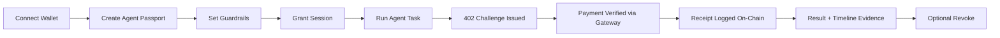

# Frontend PRD: Agent Passport Commerce App

Date: February 20, 2026  
Status: Ready for implementation

## 1. Product decisions locked

1. Primary user: solo agent owner.
2. UX model: wizard-first onboarding with an advanced settings drawer.
3. Payment/network policy: support any x402-compatible API only through our gateway.
4. Network scope at launch: Kite testnet only.
5. Auth scope now: wallet-first (org/email auth later).
6. Deployment intent: production web app (no localhost-only UX), with dockerized backend services.

## 2. Product objective

Build a user-facing app where any user can:

1. Connect wallet.
2. Create agent passport guardrails.
3. Delegate a session key safely.
4. Run autonomous paid actions.
5. Observe real-time payment + policy + receipt evidence.
6. Revoke instantly when needed.

The UX should feel premium, understandable in under 5 minutes, and clearly safer than direct agent-to-API payment flows.

## 3. Core UX principles

1. Guided first: the default path is a 4-step wizard.
2. Power available: advanced panel exists, but never blocks the guided flow.
3. Trust by visibility: every paid action shows policy check, payment proof, and receipt mapping.
4. Safety first: UI language emphasizes gateway enforcement and revocation controls.
5. Fast clarity: every error has an immediate fix path.

## 4. Information architecture

## Primary navigation

1. `Setup` (wizard)
2. `Run` (launch and monitor live actions)
3. `Timeline` (auditable stream + filters)
4. `Guardrails` (edit passport/session/revoke)
5. `Settings` (network, gateway, advanced diagnostics)

## Global UI frame

1. Top status rail:
   - wallet connected
   - chain/network badge
   - gateway health
   - latest action status
2. Left nav.
3. Main content canvas.
4. Right utility drawer (advanced details, action inspector).

## 5. End-to-end user journey



## 6. Wizard flow spec

## Step 1: Identity

Goal: establish owner + agent identity.

Inputs:
1. Owner wallet (connect button).
2. Agent address (auto-generate default, editable).

Validation:
1. Wallet connected.
2. Agent address valid EVM address.

Output:
1. Draft identity context saved locally and server-side draft created.

## Step 2: Guardrails

Goal: define safe operating policy.

Inputs:
1. Scope presets: `Wallet Enrich`, `Premium Intel`, custom scopes.
2. Spend caps: per-call cap, daily cap.
3. Rate limit per minute.
4. Service allowlist tags.
5. Passport expiry.

UX behavior:
1. “Safe / Balanced / Aggressive” quick presets.
2. Live “policy risk meter” indicating looseness/tightness.
3. Inline explanation for each guardrail.

Output:
1. Passport preview card.
2. On-chain upsert trigger with confirmation.

## Step 3: Session delegation

Goal: authorize a short-lived operational session.

Inputs:
1. Session key (auto-generate or user-provided).
2. Session expiry.
3. Optional scope subset.

Validation:
1. Session expiry must be <= passport expiry.
2. Scope subset must be inside passport scope list.

Output:
1. On-chain session grant result.
2. Session status badge: `Active`, `Expired`, `Revoked`.

## Step 4: Launch + verify

Goal: prove autonomous pay-and-retry behavior with evidence.

Inputs:
1. Route selector (`enrich-wallet`, `premium-intel`, future external connectors).
2. Iteration count.
3. Simulation mode toggle (negative tests).

Outputs shown live:
1. 402 challenge payload.
2. Payment attempt + settlement result.
3. Receipt log confirmation.
4. Final business response.

## 7. Advanced settings drawer

Hidden behind `Advanced` button in each step:

1. Raw atomic pricing values.
2. Raw scope/service keys.
3. Nonce/replay diagnostics.
4. Raw request envelope preview (read-only).
5. Chain tx hash and receipt metadata hash.
6. Manual dry-run endpoint tester (gateway-only).

Constraint: advanced settings can refine policy, but cannot bypass gateway enforcement model.

## 8. Gateway-only x402 policy in UX

The UI must make this explicit:

1. “All agent payments route through your gateway for policy enforcement.”
2. “Direct external x402 calls are disabled in production mode.”

## UX enforcement checks

1. Route registry in UI only lists gateway routes.
2. Any external API integration must be created as a gateway provider connector first.
3. If user enters a direct URL, show blocking warning with “Add Provider via Gateway” CTA.

## 9. Wireframes

## 9.1 Desktop shell

```text
+--------------------------------------------------------------------------------------------------+
| LOGO  Agent Commerce Console      [Kite Testnet] [Gateway: Healthy] [Wallet: 0xABCD...1234]    |
+----------------------+--------------------------------------------------------------------------+
| Setup                |  Step 2 of 4: Guardrails                                                 |
| Run                  |--------------------------------------------------------------------------|
| Timeline             |  Preset: ( Safe ) ( Balanced ) ( Aggressive )                           |
| Guardrails           |                                                                          |
| Settings             |  Scopes                  Services                Spending                |
|                      |  [x] enrich.wallet        [x] internal.enrich      Per call [ 1000 ]    |
|                      |  [x] premium.intel        [x] external.premium     Daily   [ 5000 ]      |
|                      |                                                  Rate/min [ 20 ]         |
|                      |                                                                          |
|                      |  Passport expires in [ 24 ] hours      Risk Meter:  [=====---] Medium   |
|                      |                                                                          |
|                      |  [Back]                                [Advanced ▾]   [Save & Continue] |
+----------------------+--------------------------------------------------------------------------+
```

## 9.2 Launch screen

```text
+--------------------------------------------------------------------------------------------------+
| Run Agent                                                                                         |
|--------------------------------------------------------------------------------------------------|
| Route: [ enrich-wallet v ]   Iterations: [ 3 ]   Mode: [ Live v ]  [Start Run]                  |
|--------------------------------------------------------------------------------------------------|
| Live Stream                                                                                       |
| 12:21:08  IDENTITY_VERIFIED     ✓                                                                 |
| 12:21:08  SCOPE_CHECKED         ✓                                                                 |
| 12:21:09  PAYMENT_REQUIRED_402  actionId=act_89...                                                |
| 12:21:11  PAYMENT_VERIFIED      tx=0xabc...                                                       |
| 12:21:13  RECEIPT_RECORDED      receipt=0xdef...                                                  |
| 12:21:13  RESPONSE_SERVED       ✓                                                                 |
|--------------------------------------------------------------------------------------------------|
| [Open Action Details] [Open Explorer] [Run Negative Test]                                         |
+--------------------------------------------------------------------------------------------------+
```

## 9.3 Timeline + evidence panel

```text
+---------------------------------------------------+----------------------------------------------+
| Timeline Filters                                  | Action Evidence                               |
|---------------------------------------------------|----------------------------------------------|
| Agent [0x....]                                    | actionId: act_89...                           |
| Event  [All v]                                    | routeId: api.enrich-wallet                    |
| Date   [Today v]                                  | quote: amount=1000 asset=USDT                 |
|                                                   | settlement: txHash=0xabc...                   |
| 12:21:08 IDENTITY_VERIFIED                        | receipt: 0xdef...                             |
| 12:21:08 PAYMENT_REQUIRED_402                     | metadataHash: 0x7c...                         |
| 12:21:11 PAYMENT_VERIFIED                         | policy snapshot: scope+caps+rate              |
| 12:21:13 RECEIPT_RECORDED                         |                                              |
|                                                   | [Copy Proof Bundle] [Open Receipt on Explorer]|
+---------------------------------------------------+----------------------------------------------+
```

## 9.4 Mobile-first wizard

```text
+--------------------------------------+
| Step 3/4: Session                    |
|--------------------------------------|
| Session Address                      |
| [0x....                          ]   |
| Session Expiry (hours)               |
| [24                              ]   |
| Scope subset                         |
| [enrich.wallet, premium.intel    ]   |
|                                      |
| Status: Active                       |
| tx: 0xabc...                         |
|                                      |
| [Back]          [Advanced] [Next]    |
+--------------------------------------+
```

## 10. Visual design direction (unique style)

Theme concept: **Mission Control Ledger**.

## Typography

1. Headline font: `Syne` (bold geometric personality).
2. Body font: `Space Grotesk`.
3. Data/ids/tx hashes: `JetBrains Mono`.

## Color system

1. Base canvas: warm off-white gradient with subtle grid texture.
2. Accent: deep teal + ember orange for action states.
3. Event colors:
   - verified/success: green
   - payment challenge: amber
   - blocked/error: red
   - pending: slate

## Motion

1. Step transition: horizontal slide with 180ms easing.
2. Timeline events: staggered reveal for new events.
3. State badges: soft pulse only while pending.

## Visual components

1. “Trust card” for each action (identity -> payment -> receipt chain).
2. “Risk meter” gauge on guardrail step.
3. Explorer chip buttons with chain icon and short hash.

## 11. Content and messaging

Tone: plain, precise, user-safe.

Examples:
1. “Payment required. Your agent received a quote and is preparing settlement.”
2. “Blocked by policy: route requires `premium.intel` scope.”
3. “Revoked successfully. Future calls from this agent are now denied.”

## 12. Accessibility and UX quality bar

1. WCAG AA contrast.
2. Keyboard-navigable wizard and drawer.
3. Screen-reader labels on all policy controls.
4. Never hide critical failures behind toasts only; persist in action panel.

## 13. Frontend-to-backend integration map

## Read APIs

1. `GET /api/passport/:agent`
2. `GET /api/actions/:actionId`
3. `GET /api/timeline/:agent`
4. `GET /api/timeline/:agent/stream`

## Write operations

Client wallet signed on-chain calls:
1. Passport upsert.
2. Session grant.
3. Passport revoke.

Gateway-only run operations:
1. `POST /api/enrich-wallet`
2. `POST /api/premium-intel`

## 14. Production deployment model

## Frontend

1. Next.js app deployed on Vercel.
2. Environment points to public gateway URL.
3. No private keys in frontend env.

## Backend stack (dockerized)

1. Gateway container.
2. Runner container.
3. Postgres container (or managed Postgres in prod).
4. Optional Redis container for distributed limits/cache.

## Release environments

1. `staging` (testnet, low-price test profile).
2. `production-demo` (testnet but hardened controls and public URL).

## 15. Telemetry and analytics

Track:

1. Wizard drop-off by step.
2. Passport creation success rate.
3. Session grant success rate.
4. First paid action completion time.
5. Revocation latency until first blocked call.

## 16. MVP acceptance criteria

1. New user can complete setup and first paid action in under 5 minutes.
2. UI clearly shows action-level call-to-payment-to-receipt mapping.
3. Policy violations are explained and reproducible from UI.
4. Revocation blocks next call immediately and visibly.
5. All paid calls in UI are routed through gateway endpoints only.

## 17. Phase-2 backlog

1. Team accounts + RBAC.
2. Multi-agent dashboard.
3. External provider catalog with compatibility testing.
4. Mainnet toggle with stricter confirmation and spend warnings.
5. Exportable signed compliance report bundle.
